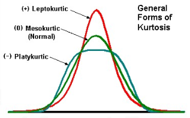

# Afkast definitioner
Først vil jeg definere forskellige former for afkast.
Vi starter med at lade $p_t$ være prise til tid $t$ af et aktiv.

Det simple **netto afkast** fra tid $t-1$ til tid $t$ givet ved
$$ R_t = \frac{p_t - p_{t - 1}}{p_{t-1}} \quad (\text{Procentændring i $p_t$}). $$
Bemærk at vi kan lave omskrivningen
$$ \frac{p_t - p_{t - 1}}{p_{t-1}} = \frac{p_t}{p_{t-1}} - 1, $$
for at få det simple **brutto afkast** der er defineret ved
$$ 1 + R_t = \frac{p_t}{p_{t - 1}}. $$

# Log afkast
Hvis $R_t$ er defineret som på forrige slide, så er **log afkastet** defineret som
$$ r_t = \log( 1 + R_t ) = \log\left(\frac{p_t}{p_{t - 1}}\right) = \log p_t - \log  p_{t - 1} = \nabla \log p_t.$$

# Finansielle tidsrækker
Lader vi prisen for et aktiv være $x_t$ og afkastet være $y_t$ så gælder den følgende relation
$$ y_t = \frac{x_t - x_{t - 1}}{x_{t - 1}} \quad \text{eller} \quad y_t = \nabla \log x_t. $$

Empirien for afkast-tidsrækker fortæller os at:
\begin{enumerate}
  \item Fravær af autokorrelation i $y_t$
  \item Signifikant autokorrelaion i $y^2_t$ og $|y_t|$
  \item Tunge haler
  \item Volatilitets klyngning
\end{enumerate}

# Topstejlhed
Topstejlhed eller **kurtosis** er det 4. moment og er defineret som
$$ \kappa = \frac{\mathbb{E}\left[X - \mu\right]^4}{\left(\mathbb{E}\left[X - \mu\right]^2\right)^2} - 3. $$

{width=200px}

# ARCH(1)
Hvis vi lader $\varepsilon_t \sim N(0,1)$ være i.i.d. og $\alpha_0 > 0, \alpha_1 > 0$. Så kaldes
\begin{align*}
    y_t &= \sigma_t \varepsilon_t\\
    \sigma_t^2 &= \alpha_0 + \alpha_1 y_{t-1}^2
\end{align*}
for en ARCH(1) model.
